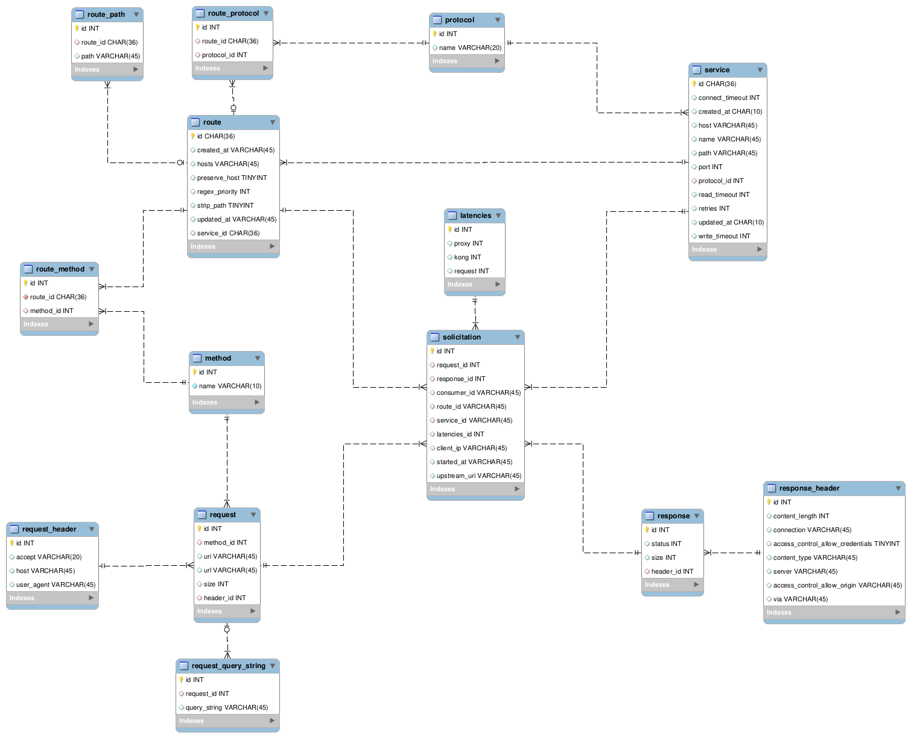

# Teste Técnico - Data Engineer

O teste técnico para a vaga de engenheiro de dados consiste na modelagem de um banco de dados relacional para o armazenamento de informações geradas por um sistema gateway, a inserção de dados de logs nesse banco, e a geração de relatórios sobre esses dados.

## Instruções

Para executar os testes é necessário possuir git, Docker, e Python (>=3.6) instalados.

Primeiro você deve clonar o repositório para sua máquina com git.

```bash
$ git clone https://github.com/arthurcerveira/Teste-Tecnico-Melhor-Envio.git
$ cd Teste-Melhor-Envio
```

Então é necessário instalar as dependências do Python com pip.

```bash
$ pip install -r requirements
```

### Inicializando o banco de dados

Esse projeto utiliza um banco de dados MySQL para o armazenamento dos dados. Esse banco de dados pode ser inicializado como um container Docker.

```bash
$ docker run --name=mysql_melhorenvio --publish 3306:3306 -e MYSQL_ROOT_PASSWORD='123' -e  MYSQL_ROOT_HOST=172.17.0.1 mysql/mysql-server -d
```

A senha do usuário `root` do banco de dados deve ser definida como uma variável de ambiente para o funcionamento dos scripts.

```bash
$ export MYSQL_ROOT_PASSWORD='123'
```

Para inicializar as tabelas do banco de dados, é necessário executar o script `setup_database.py`.

```bash
$ cd scripts/database/
$ python setup_database.py
```

### Executando os scripts

Primeiro é necessário adicionar os dados do arquivo `data/logs.txt` no banco de dados, definindo seu caminho como argumento de linha de comando.

```bash
$ cd scripts/
$ python add_log_to_database.py ../data/logs.txt
```

Então podem ser executados os scripts para gerar os relatórios.

```bash
$ python consumers_report.py
$ python latencies_report.py
$ python services_report.py
```

Esse scripts geram arquivos CSV com os resultados, disponíveis no diretório `reports` na raiz do projeto.

## Diagrama Entidade Relacionamento do banco de dados

O diagrama entidade relacionamento do banco de dados foi gerado com a ferramenta MySQL Workbench.


